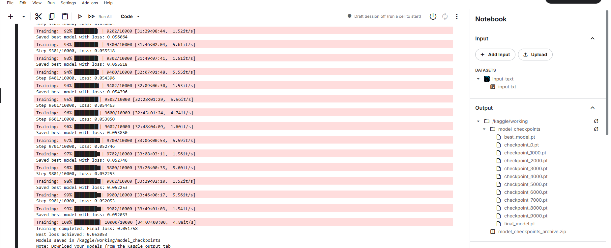

# Training Transformers from Scratch

This project demonstrates how to train transformers from scratch. Refer to the `Kaggle_notebook.py` file for details on the architecture, hyperparameters, and the approach that achieved:
- Final loss: 0.051758
- Best loss achieved: 0.052053

It's trained on [input.txt](./input.txt), which has 338025 tokens. Training activity was done on Kaggle, leveraging some pretrained GPT-2 tokens for additional clarity. For more information, see the code in `Kaggle_notebook.py`.

## Architecture
The code in `Kaggle_notebook.py` implements a GPT-inspired transformer model comprising multi-head self-attention layers and feed-forward blocks. It uses positional embeddings, layer normalization, and residual connections. Hyperparameters like attention heads, hidden size, and dropout are configured to balance performance and efficiency.

### Further Details
Within `Kaggle_notebook.py`, each multi-head attention operation splits the embedding dimension into multiple heads, allowing the model to attend to different positions independently. The feed-forward block processes each token’s representation through a two-layer network, capturing non-linear transformations. Positional embeddings ensure that the model understands the order of tokens, while residual connections help stabilize training and allow deeper stacking of layers.

## Steps to Understand
1. Load and prepare the dataset with tokenization to feed tokens into the model.
2. Embed the tokens to map them into a dense vector space.
3. Apply multi-head self-attention to capture context from various positions.
4. Pass the attention outputs through feed-forward layers for non-linear transformations.
5. Use layer normalization and residual connections to stabilize and deepen the architecture.
6. Optimize the model by tuning hyperparameters (e.g., attention heads, dropout, hidden size).
7. Monitor the training loss and evaluate on validation steps to ensure convergence.

## Training Logs
Below is an image showing the training progress:

Logs indicate a steady improvement, showing the model’s convergence over multiple epochs.